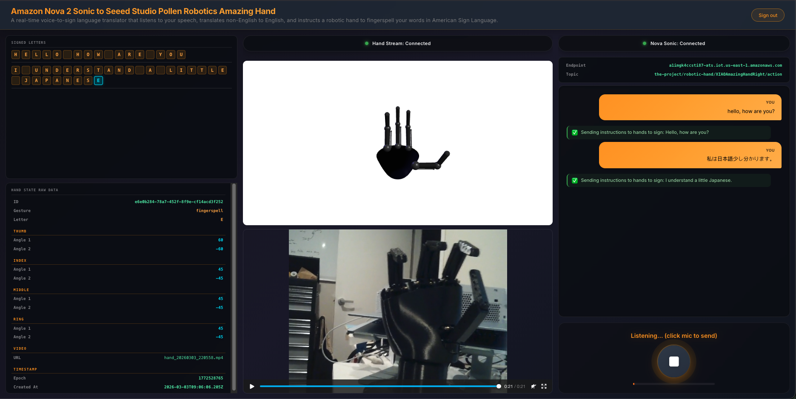
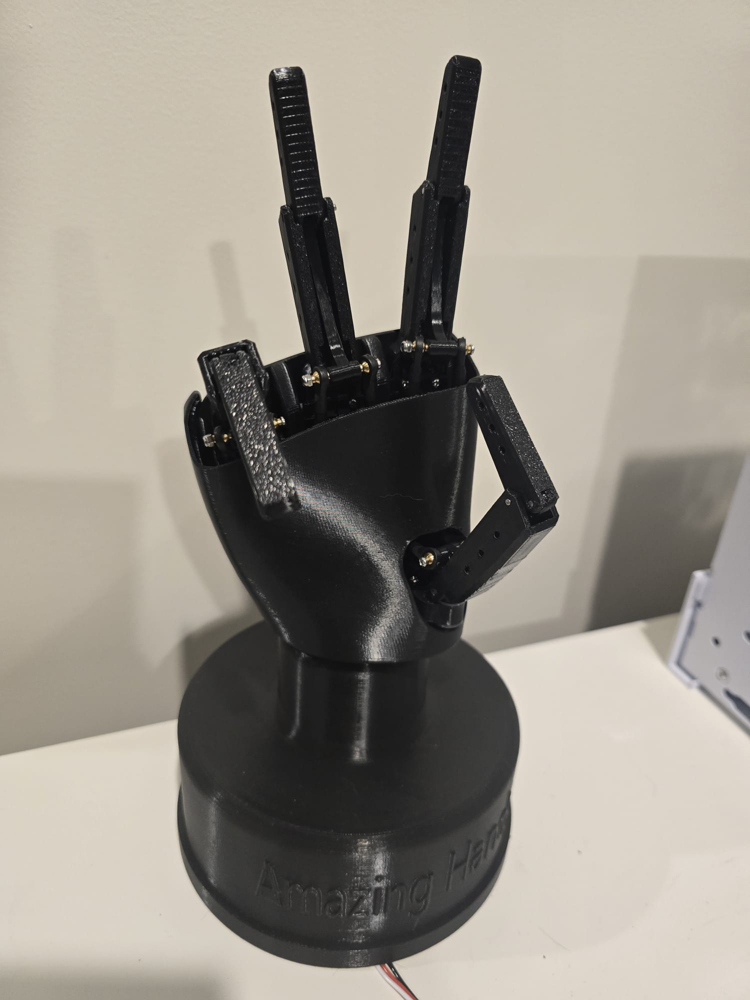
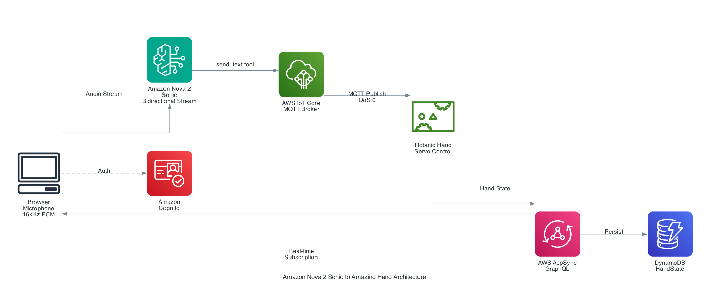

# Amazon Nova 2 Sonic to Seeed Studio Pollen Robotics Amazing Hand

> **Model:** Amazon Nova 2 Sonic (`amazon.nova-2-sonic-v1:0`) on Amazon Bedrock — bidirectional speech-to-speech streaming with tool use

A real-time voice-to-sign language translator powered by **Amazon Nova 2 Sonic** that listens to your speech, cleans it up into clear sentences, automatically translates non-English languages into English, and instructs a robotic hand to physically fingerspell your words in American Sign Language — while showing a live 3D animation, video feed of the real hand, and a running history of every letter signed.





## Related Repositories

This project is one of three repositories that together form the end-to-end voice-controlled robotic hand signing system. Each repo has an accompanying blog post that walks through the design and implementation.

| Repository | Purpose | Blog |
|------------|---------|------|
| [amplify-react-nova-sonic-voice-chat-amazing-hand](https://github.com/chiwaichan/amplify-react-nova-sonic-voice-chat-amazing-hand) | **Frontend & Voice Processing (this repo)** — React web app that captures speech via Amazon Nova 2 Sonic, publishes servo commands over MQTT, and displays a live 3D hand animation with real-time state updates | [Read blog](https://www.chiwaichan.co.nz/blog/2026/03/13/real-time-voice-to-sign-language-amazon-nova-sonic-amazing-hand) |
| [cdk-iot-amazing-hand-streaming](https://github.com/chiwaichan/cdk-iot-amazing-hand-streaming) | **IoT-to-AppSync Infrastructure** — AWS CDK stack that routes robotic hand state data from AWS IoT Core through Lambda to AppSync, enabling real-time GraphQL subscriptions for clients | [Read blog](https://www.chiwaichan.co.nz/blog/2026/03/14/voice-to-sign-language-cloud-infrastructure-iot-appsync-cdk) |
| [strands-agents-amazing-hands](https://github.com/chiwaichan/strands-agents-amazing-hands) | **Edge AI Agent** — Strands Agent running on NVIDIA Jetson that receives MQTT commands, uses Amazon Nova 2 Lite to translate them into servo movements for the physical Amazing Hand, records video, and publishes state back via IoT Core | [Read blog](https://www.chiwaichan.co.nz/blog/2026/03/15/voice-to-sign-language-edge-ai-agent-strands-nvidia-jetson-amazing-hand) |

## Architecture Overview



### Data Flow

1. **Speech Capture** — The browser captures microphone audio via an AudioWorklet processor at the device's native sample rate, resamples to 16 kHz mono 16-bit PCM, and base64-encodes it
2. **Bedrock Streaming** — Audio chunks are sent to Amazon Nova 2 Sonic (`amazon.nova-2-sonic-v1:0`) via `InvokeModelWithBidirectionalStreamCommand`, a bidirectional streaming API
3. **Speech Processing** — Nova 2 Sonic transcribes the speech, cleans up grammar and filler words, translates non-English to English, and invokes the `send_text` tool with the cleaned sentence
4. **MQTT Publishing** — The cleaned sentence is published to AWS IoT Core on the topic `the-project/robotic-hand/XIAOAmazingHandRight/action`
5. **Robotic Hand Control** — The physical robotic hand receives the MQTT message and executes servo movements to fingerspell each letter
6. **Real-time Feedback** — The robotic hand writes its state (servo angles, current letter, gesture, video URL) back to DynamoDB via AppSync, which pushes updates to the browser through a GraphQL subscription
7. **3D Visualization** — The browser renders a synchronized Three.js 3D hand model using the incoming servo angles

## Tech Stack

| Layer | Technology | Purpose |
|-------|-----------|---------|
| Frontend | React 19, Vite 7, TypeScript 5.9 | Application UI and build tooling |
| 3D Rendering | Three.js 0.182 | Robotic hand visualization with OrbitControls |
| Authentication | Amazon Cognito (via Amplify Gen 2) | Email-based user sign-up and sign-in |
| Speech Processing | Amazon Nova 2 Sonic on Bedrock | Bidirectional speech-to-speech streaming with tool use |
| Messaging | AWS IoT Core (MQTT) | Publish servo commands to the robotic hand |
| Data & Real-time | AWS AppSync (GraphQL) + DynamoDB | Hand state persistence and real-time subscriptions |
| Infrastructure | AWS Amplify Gen 2 (CDK) | Infrastructure-as-code backend deployment |

## AWS Services and Permissions

### IAM Permissions (Authenticated Users)

| Service | Actions | Resource |
|---------|---------|----------|
| Amazon Bedrock | `bedrock:InvokeModel`, `bedrock:InvokeModelWithResponseStream` | `arn:aws:bedrock:us-east-1::foundation-model/amazon.nova-2-sonic-v1:0` |
| AWS IoT Core | `iot:Publish`, `iot:Connect` | `arn:aws:iot:us-east-1:{ACCOUNT_ID}:topic/the-project/robotic-hand/*`, `arn:aws:iot:us-east-1:{ACCOUNT_ID}:client/*` |
| AWS IoT Core | `iot:DescribeEndpoint`, `iot:AttachPolicy` | `*` (account-level) |

### IoT Core Policy

A CloudFormation `CfnPolicy` named `RoboticHandPolicy-{stackName}` is created, granting:
- `iot:Publish` on topic `the-project/robotic-hand/*/action`
- `iot:Connect` with any client ID

This policy is dynamically attached to the authenticated user's Cognito identity at runtime.

## Amazon Nova 2 Sonic Configuration

| Parameter | Value |
|-----------|-------|
| Model ID | `amazon.nova-2-sonic-v1:0` |
| Region | `us-east-1` |
| Max Tokens | 1024 |
| Temperature | 0.7 |
| Top-P | 0.9 |
| Voice ID | `matthew` |
| Input Audio | 16 kHz, 16-bit PCM, mono, base64-encoded |
| Output Audio | 24 kHz, 16-bit PCM, mono, base64-encoded |
| Tool Choice | `any` (forced tool use on every utterance) |

### System Prompt Behavior

Nova 2 Sonic is configured as a **speech-to-text relay**, not a conversational assistant. It:

- Forwards **every** user utterance to the `send_text` tool without exception
- Cleans up grammar and removes filler words (um, uh, like)
- **Translates non-English speech to English** before forwarding
- Never interprets, refuses, or responds to user messages
- Returns only "Sent" as spoken confirmation

### Tool Definition: `send_text`

```json
{
  "name": "send_text",
  "description": "Forward a cleaned-up sentence as a raw message to MQTT. You MUST call this for every single user utterance without exception, regardless of content.",
  "inputSchema": {
    "type": "object",
    "properties": {
      "sentence": {
        "type": "string",
        "description": "The cleaned-up, well-formed sentence"
      }
    },
    "required": ["sentence"]
  }
}
```

## Audio Pipeline

### Recording (Browser → Bedrock)

1. **Capture** — `AudioWorkletProcessor` named `audio-capture-processor` captures audio in 2048-sample buffers with echo cancellation and noise suppression enabled
2. **Resample** — Linear interpolation from device sample rate (typically 44.1 kHz or 48 kHz) down to 16 kHz
3. **Encode** — Float32 samples are converted to 16-bit signed PCM, then base64-encoded
4. **Stream** — Base64 chunks are pushed into the bidirectional stream as `audioInput` events

### Playback (Bedrock → Browser)

1. **Receive** — Base64-encoded `audioOutput` events from Nova 2 Sonic
2. **Decode** — Base64 → Uint8Array → Float32Array
3. **Buffer** — Create `AudioBuffer` at 24 kHz sample rate
4. **Queue** — FIFO queue with sequential playback via Web Audio API `AudioContext`

## MQTT Payload Formats

### Sentence Message

Published when Nova 2 Sonic processes a user utterance:

```json
{
  "id": "uuid-v4",
  "sentence": "Show me the video.",
  "ts": 1772356074
}
```

### Servo Command Message

Published when signing ASL sequences (chunked if >10 poses):

```json
{
  "id": "uuid-v4",
  "chunk": 0,
  "totalChunks": 1,
  "action": "fingerspell",
  "word": "hello",
  "poses": [
    { "h": "R", "r": [0, 180, 180, 180], "ms": 500 }
  ],
  "ts": 1772356074
}
```

| Field | Description |
|-------|------------|
| `h` | Hand side: `R` (right), `L` (left), `B` (both) |
| `r` / `l` | Servo positions array: `[thumb, index, middle, ringPinky]` (0–180°) |
| `ms` | Hold duration in milliseconds |

## GraphQL Schema (AppSync + DynamoDB)

### HandState Model

| Field | Type | Required | Description |
|-------|------|----------|-------------|
| `id` | ID | Yes | Auto-generated |
| `deviceName` | String | Yes | Device identifier (e.g., `XIAOAmazingHandRight`) |
| `gesture` | String | No | Current gesture name (e.g., `fingerspell`) |
| `letter` | String | No | Current letter being signed |
| `thumbAngle1` | Int | No | Thumb proximal servo angle |
| `thumbAngle2` | Int | No | Thumb distal servo angle |
| `indexAngle1` | Int | No | Index proximal servo angle |
| `indexAngle2` | Int | No | Index distal servo angle |
| `middleAngle1` | Int | No | Middle proximal servo angle |
| `middleAngle2` | Int | No | Middle distal servo angle |
| `ringAngle1` | Int | No | Ring/pinky proximal servo angle |
| `ringAngle2` | Int | No | Ring/pinky distal servo angle |
| `timestamp` | Int | Yes | Unix epoch timestamp |
| `videoUrl` | String | No | URL of the recorded signing video |
| `createdAt` | AWSDateTime | Yes | Auto-generated creation timestamp |

**Authorization:** API Key (public read/write, 30-day expiration)

The browser subscribes to `onCreateHandState` filtered by `deviceName` to receive real-time servo angle updates, which drive the 3D hand animation and populate the hand state data panel.

## 3D Hand Model (Three.js)

The hand visualization is a procedurally generated robotic hand with industrial aesthetics:

- **Palm** — LatheGeometry solid cup shape (32 segments), wider at knuckles, tapered at wrist
- **4 Fingers** — Thumb, index, middle, ring/pinky, each with:
  - Knuckle ball joint (SphereGeometry)
  - Proximal bone (CylinderGeometry)
  - Mechanical linkage bar (thin CylinderGeometry parallel to bone)
  - Mid-finger joint (SphereGeometry)
  - Distal bone (CylinderGeometry)
  - Rounded fingertip (SphereGeometry)
- **Materials** — MeshStandardMaterial with metallic/rough properties for an industrial robotic appearance
- **Two hands** — Right and left (mirrored via `scale.x = -1`), toggled by hand state
- **Camera** — PerspectiveCamera (FOV 50°), OrbitControls with zoom range 2–15 units
- **Lighting** — Ambient + directional + fill light with PCFSoftShadowMap shadows
- **Resize** — `ResizeObserver` ensures the canvas stays properly sized within the flex layout

### Servo Angle Mapping

The robotic hand uses 8 servos (2 per finger: proximal and distal). Angles map from the hand state's `-90° to 90°` range to radians: `angle_rad = (angle / 90) * (π / 2)`. The thumb rotates on the Z-axis; all other fingers rotate on the X-axis.

## ASL Sign Data

The application includes predefined servo positions for:

- **26 alphabet letters** (A–Z) — Single right-hand poses for fingerspelling
- **28 common words** — Multi-pose sequences including: hello, hi, yes, no, thanks, thank you, please, help, sorry, love, i love you, good, bad, stop, go, eat, drink, water, friend, family, happy, sad, name, more, done, want, like, welcome
- **6 gestures** — thumbs_up, wave (5-pose sequence), point, open, close, peace

Each pose specifies which hand(s) to use, 4 servo positions per hand (0–180°), and a hold duration in milliseconds.

## UI Layout

The interface is a fullscreen three-column layout locked to viewport height:

| Column | Width | Contents |
|--------|-------|----------|
| Left (Data) | 30% | Signed Letters history (40%), Hand State raw data grid (60%) |
| Center (Visualization) | 40% | Hand Stream status bar, 3D hand animation (50%), video player (50%) |
| Right (Voice Chat) | 30% | Nova 2 Sonic status bar, IoT endpoint/topic info, transcript feed, microphone button with level bar |

On screens narrower than 1100px, the layout collapses to a single stacked column.

## Prerequisites

- Node.js 18.x or later
- AWS Account with credentials configured (`aws configure`)
- Amazon Nova 2 Sonic model access enabled in Amazon Bedrock (us-east-1)

## Setup

### 1. Enable Amazon Nova 2 Sonic Model Access

1. Open the [Amazon Bedrock console](https://console.aws.amazon.com/bedrock/) in **us-east-1** (N. Virginia)
2. Navigate to **Model access** in the left sidebar
3. Click **Modify model access**
4. Enable **Amazon Nova 2 Sonic**
5. Click **Save changes**

### 2. Install Dependencies

```bash
npm install
```

### 3. Start the Amplify Sandbox

This deploys a personal cloud sandbox with Cognito User Pool, Cognito Identity Pool, AppSync API, DynamoDB table, and IoT Core policy:

```bash
npm run sandbox
```

The sandbox generates `amplify_outputs.json` with all endpoint and credential configuration. Keep this terminal running — it watches for backend changes.

### 4. Start the Development Server

In a new terminal:

```bash
npm run dev
```

### 5. Open the Application

Navigate to `http://localhost:5173`. Create an account with your email, sign in, and click the microphone button to begin.

## Project Structure

```
├── amplify/
│   ├── auth/
│   │   └── resource.ts              # Cognito email auth configuration
│   ├── data/
│   │   └── resource.ts              # HandState GraphQL schema + API key auth
│   ├── backend.ts                   # IAM policies (Bedrock, IoT) + IoT CfnPolicy
│   └── tsconfig.json
├── src/
│   ├── components/
│   │   ├── HandAnimation.tsx         # Three.js procedural robotic hand
│   │   ├── HandAnimation.css
│   │   ├── VoiceChat.tsx             # Main UI: 3-column layout, state management
│   │   └── VoiceChat.css
│   ├── hooks/
│   │   ├── useNovaSonic.ts           # Bedrock bidirectional stream + tool handling
│   │   ├── useAudioRecorder.ts       # AudioWorklet mic capture + resampling
│   │   ├── useAudioPlayer.ts         # Web Audio API playback queue
│   │   └── useHandStream.ts          # AppSync GraphQL subscription
│   ├── utils/
│   │   ├── iotPublisher.ts           # MQTT publish + IoT policy attachment
│   │   └── audioUtils.ts             # PCM/Float32/Base64 conversions
│   ├── data/
│   │   └── aslSigns.ts              # ASL alphabet, words, gestures servo data
│   ├── App.tsx                       # Amplify Authenticator wrapper
│   ├── App.css
│   ├── index.css
│   └── main.tsx                      # Entry point with Amplify configuration
├── amplify_outputs.json              # Generated Amplify config (git-ignored)
├── package.json
├── vite.config.ts
├── tsconfig.json
├── tsconfig.app.json
└── tsconfig.node.json
```

## Available Scripts

| Command | Description |
|---------|-------------|
| `npm run dev` | Start Vite development server on `localhost:5173` |
| `npm run build` | Type-check with `tsc` and build for production |
| `npm run lint` | Run ESLint |
| `npm run preview` | Preview production build locally |
| `npm run sandbox` | Deploy Amplify sandbox environment |
| `npm run sandbox:delete` | Tear down the sandbox environment |

## Deploying to Production

1. Push your code to a Git repository (GitHub, GitLab, etc.)
2. Open the [AWS Amplify Console](https://console.aws.amazon.com/amplify/)
3. Connect your repository
4. Amplify automatically detects the Gen 2 backend and deploys all resources
